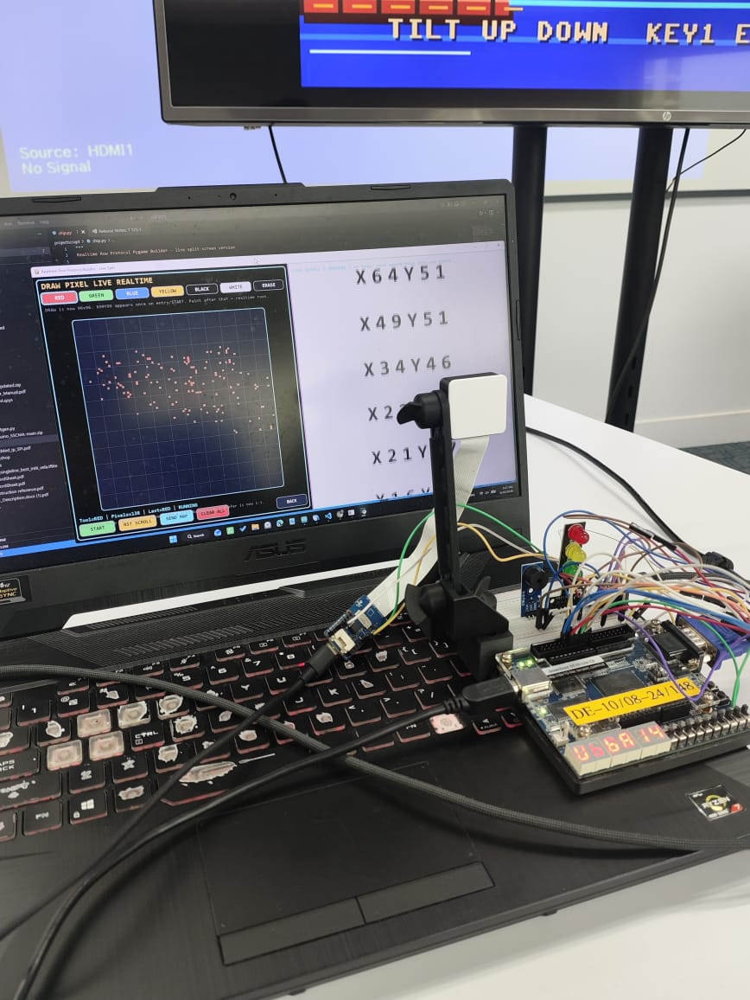
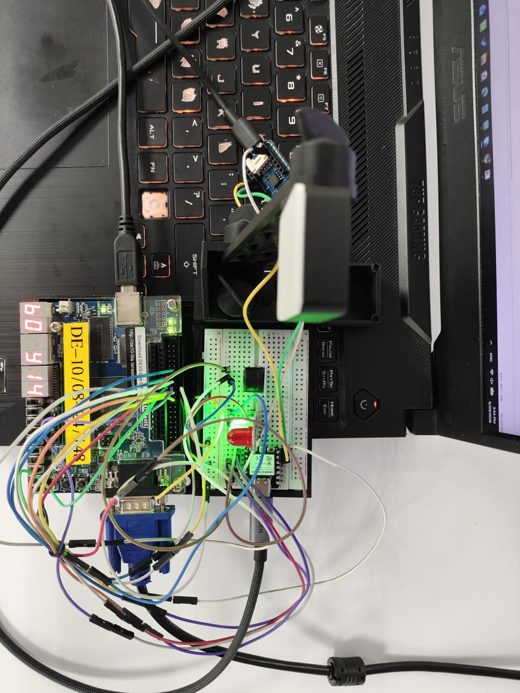
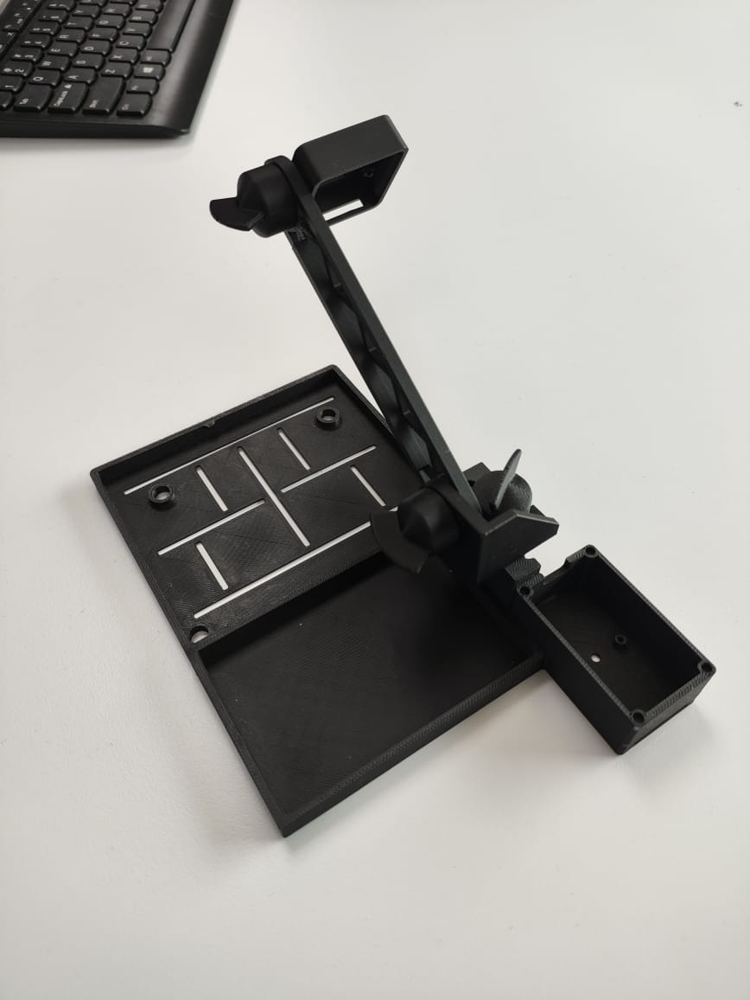
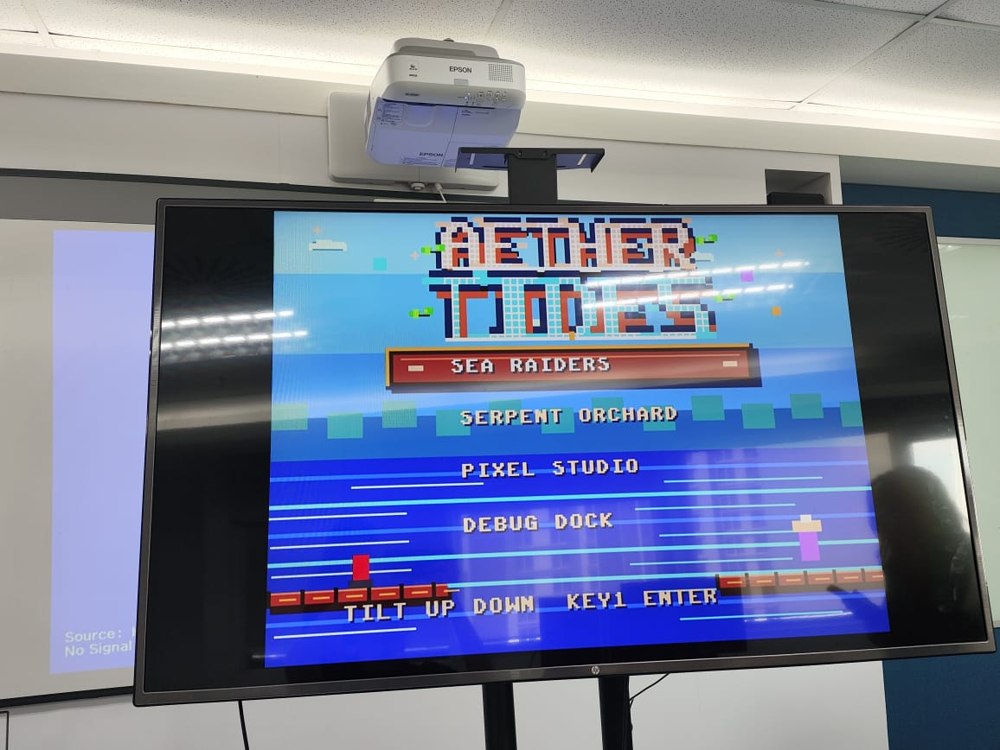
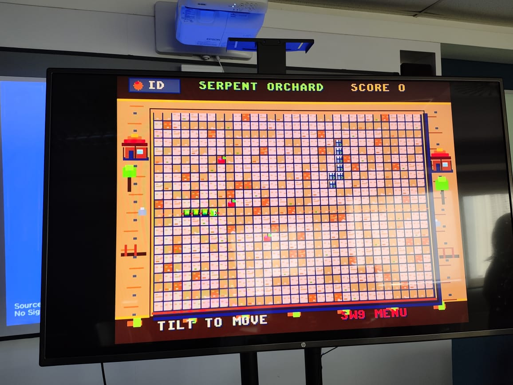
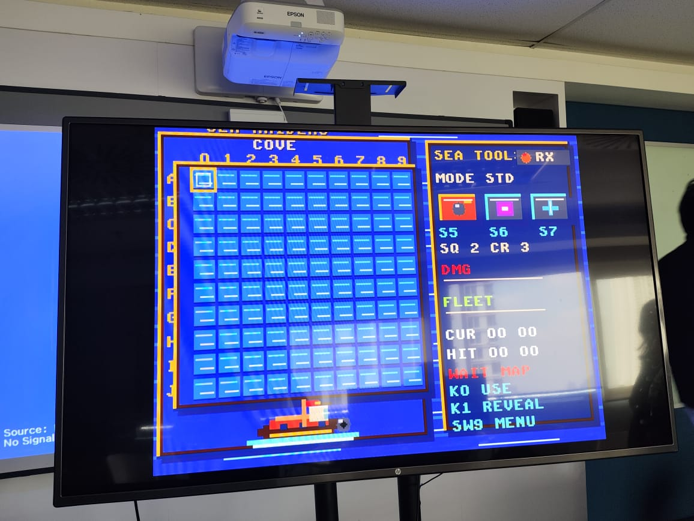
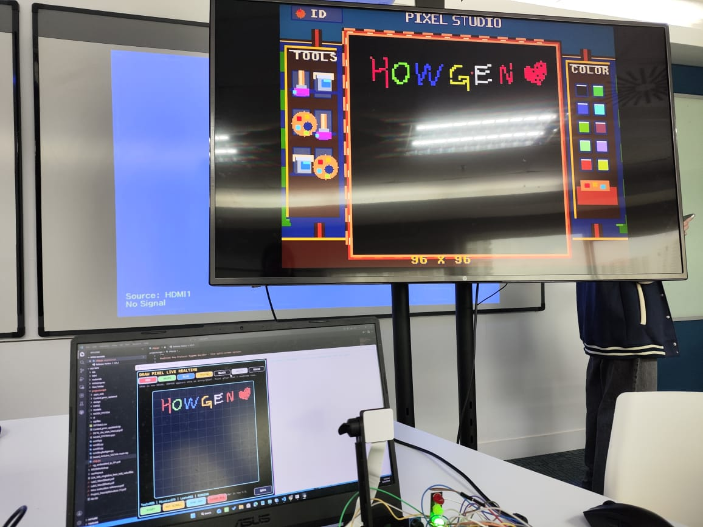

# ECE3073 DE10-Lite Triple-Core AI Snake

A real-time embedded vision and FPGA gaming project developed for the ECE3073 mini-project on **Real-Time Embedded Vision using ARM and FPGA-based multitasking systems**.

The system integrates a **DE10-Lite FPGA**, **triple-core Nios II architecture**, **Grove Vision AI V2**, **ESP32-C3**, camera input, VGA graphics, accelerometer motion control, LEDs, HEX displays, and speaker output. The final implementation runs a VGA-based multi-game interface with **Classic Snake**, **Draw Pixel**, and **Battleship**, while demonstrating real-time OCR/image capture, shared-memory communication, and FPGA-based multitasking.

---

## About This Project

This project demonstrates how an FPGA-based embedded system can combine real-time vision, hardware peripherals, multitasking software, and graphics rendering in one integrated platform.

The system is built around a **triple-core Nios II design**:

| Core | Main Responsibility |
|---|---|
| **Control Core** | Handles switches, push-buttons, LEDs, HEX displays, audio output, RTOS tasks, and system control flow. |
| **Image Core** | Receives camera/OCR data from the Grove Vision AI V2 and ESP32-C3 communication path, then prepares visual or text data for the FPGA system. |
| **VGA Core** | Renders menus, gameplay screens, captured images, overlays, and real-time graphics to an external VGA monitor. |

The project connects software logic with physical FPGA hardware. Users interact through the DE10-Lite switches, push-buttons, accelerometer, camera, VGA monitor, LEDs, HEX displays, and speaker.

---

## Project Showcase

> Place all images inside the repository folder `assets/`. The filenames below must match exactly, including uppercase letters and file extensions.

<p align="center">
  
</p>

<p align="center"><b>Full Hardware Setup</b></p>

<table align="center">
  <tr>
    <td align="center" width="50%">
      <br>
      <b>Bird-Eye Hardware View</b>
    </td>
    <td align="center" width="50%">
      <br>
      <b>3D-Printed Mount</b>
    </td>
  </tr>
</table>

<table align="center">
  <tr>
    <td align="center" width="50%">
      <br>
      <b>Main Menu</b>
    </td>
    <td align="center" width="50%">
      <br>
      <b>Snake Game</b>
    </td>
  </tr>
  <tr>
    <td align="center" width="50%">
      <br>
      <b>Battleship</b>
    </td>
    <td align="center" width="50%">
      <br>
      <b>Draw Pixel</b>
    </td>
  </tr>
</table>

---

## Key Features

### Core Architecture and Processing

- **Triple-Core Nios II System**: Separates control, image, and VGA workloads across dedicated soft-core processors.
- **Shared SDRAM Communication**: Uses shared memory regions to exchange runtime variables and debug data between cores.
- **μC/OS-II Real-Time Operating System**: Runs on the control processor for deterministic task scheduling and peripheral updates.
- **Parallel Task Execution**: Reduces I/O blocking by separating image processing, game logic, and VGA rendering.

### Vision and Communication

- **Grove Vision AI V2 + Camera**: Captures physical images or text for image/OCR-based interaction.
- **ESP32-C3 Interface**: Transfers processed visual or text data into the FPGA system.
- **SPI/UART Communication**: Provides communication between the FPGA and external vision/communication modules.
- **OCR Command Ingestion**: Reads text input, detects command delimiters, and forwards parsed instructions into the embedded system.

### VGA Graphics and Gameplay

- **VGA Graphics Engine**: Outputs RGB332 8-bit colour graphics to an external monitor.
- **Main Menu Interface**: Provides menu navigation for the available game modes.
- **Classic Snake**: Uses accelerometer-based movement, score tracking, LED feedback, and audio feedback.
- **Draw Pixel**: Provides a 96x96 pixel drawing canvas with optional camera-captured grayscale background rendering.
- **Battleship**: Uses tilt-based cursor control and grid-based targeting mechanics.

### Hardware Interaction

- **Switches and Push-buttons**: Used for display control, menu actions, camera capture, game actions, and speaker control.
- **ADXL345 Accelerometer**: Converts DE10-Lite board tilt into motion controls and cursor movement.
- **HEX Displays**: Show status, score, CPU usage, or system messages.
- **LEDs**: Provide visual feedback for game events and system states.
- **Speaker/Buzzer**: Produces sound effects and status audio.

---

## Hardware Requirements

- DE10-Lite FPGA board with USB cable
- Breadboard and jumper wires
- Grove Vision AI V2 module
- 5MP OV5647 camera module with camera ribbon
- ESP32-C3 module
- VGA monitor and VGA connector
- Crow-tail speaker or buzzer
- LED module
- 3D-printed camera or hardware mount

---

## Software Requirements

- Intel Quartus Prime Lite
- Nios II Software Build Tools for Eclipse
- DE10-Lite board support files
- ESP32/Grove Vision AI development tools, if modifying the external vision module code
- Python, if using the companion UI or OCR command-generation tools

---

## Repository Structure

```text
ECE3073-Project2025-Lab02-Group4/
│-- M1/              # Milestone 1: VGA controller and basic hardware interfaces
│-- M2/              # Milestone 2: image convolution and SPI/gyro communication
│-- project/         # Main integrated Quartus/Nios project files
│-- assets/          # README images and project screenshots
│-- .gitignore       # Git ignore rules for generated Quartus/project files
│-- README.md        # Project documentation
```

Expected `assets/` folder:

```text
assets/
│-- 3DprintedMount.jpeg
│-- BattleShip_Menu.jpeg
│-- BirdEyeView_Setup.jpeg
│-- DrawPixel_Menu.jpeg
│-- IsometricView_Setup.jpeg
│-- MainMenu.jpeg
│-- SnakeGame_Menu.jpeg
```

---

## Getting Started

1. Clone the repository:

   ```sh
   git clone https://github.com/ece3073-monash/project-templates.git
   ```

2. Copy the template files and `.gitignore` into the project directory if required.
3. Open the hardware project in Intel Quartus Prime Lite.
4. Compile the FPGA design.
5. Program the DE10-Lite board.
6. Open the Nios II software workspace in Eclipse.
7. Build and run the software on the required Nios II processor cores.
8. Connect the VGA monitor, Grove Vision AI V2, camera, ESP32-C3, speaker, LEDs, and required peripherals.

---

## Device Operation

### Main Controls

| Control | Function |
|---|---|
| `SW1` | Enables the 7-segment HEX displays. |
| `SW2` | Enables captured OCR/text rendering. |
| `SW3` | Displays CPU utilisation on the HEX display. |
| `SW4` | Enables or disables the speaker system. |
| `KEY0` | Menu confirmation, retry, image display, or game-specific action. |
| `KEY1` | Camera capture or game-specific action. |
| Accelerometer | Controls movement, cursor direction, board tilt, or in-game navigation. |

### Output Devices

| Output | Function |
|---|---|
| VGA monitor | Displays menus, game screens, captured images, graphics, and overlays. |
| LEDs | Shows score feedback, game events, and system states. |
| HEX displays | Shows text, score, CPU usage, or status messages. |
| Speaker/Buzzer | Plays sound effects and status feedback. |

---

## Game Modes

### Classic Snake

A VGA-rendered Snake game controlled using the DE10-Lite accelerometer. The player steers the snake by tilting the board, collects apples to increase score and length, and receives feedback through LEDs and sound effects.

### Draw Pixel

A 96x96 pixel drawing mode that allows the user to interact with a digital canvas. A camera snapshot can be captured and rendered into the background layer as a grayscale image reference.

### Battleship

A grid-based targeting game that uses accelerometer tilt to move the cursor. The player selects strike positions and receives VGA-rendered feedback during gameplay.

---

## Milestones

### Milestone 1: VGA Controller and Basic Hardware Interface

- Implemented initial Nios II hardware setup.
- Integrated switches, HEX display, VGA output, speaker, LEDs, SPI, and accelerometer testing.
- Completed basic hardware peripheral control and system integration.

### Milestone 2: Image Convolution and SPI/Gyro Integration

- Integrated Grove Vision AI V2 and camera pipeline.
- Stored received image data into SDRAM.
- Connected accelerometer movement to VGA display output.
- Added push-button interrupt handling and GPIO latency measurements.
- Tested communication between the control core and image core.

### Milestone 3: Full System Integration

- Implemented triple-core Nios II system architecture.
- Integrated Snake, Draw Pixel, and Battleship gameplay.
- Added μC/OS-II RTOS scheduling on the control core.
- Added sound effects, visual feedback, game menus, and real-time VGA rendering.

---

## Final Outcome

The final project demonstrates a complete FPGA-based embedded vision and gaming system. It combines camera input, OCR/image handling, real-time VGA graphics, accelerometer motion control, hardware audio, LEDs, HEX displays, and multi-core processing into one integrated DE10-Lite platform.

---

## Contributors

| Name | Student ID | Email |
|---|---:|---|
| Chin Wei Chun | 33520569 | wchi0051@student.monash.edu |
| Sean Loh Kim Fook | 34640509 | sloh0020@student.monash.edu |
| Ooi Li Xiang | 33070040 | looi0005@student.monash.edu |

---

## License

Copyright © 2026 Monash University.
