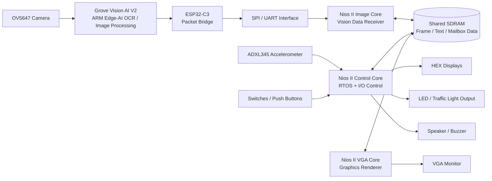

# ECE3073 DE10-Lite Triple-Core Embedded Vision SoC

<div align="center">

**A hardware-software co-design project on FPGA-based multicore processing, real-time embedded vision, and memory-mapped peripheral control.**

`DE10-Lite FPGA` · `Nios II` · `Grove Vision AI V2` · `ESP32-C3` · `SPI/UART` · `Shared SDRAM` · `VGA` · `RTOS` · `Accelerometer` · `HW/SW Co-Design`

</div>

---

## About the Project

This repository contains the final implementation for the **ECE3073 Real-Time Embedded Vision Using ARM, Grove AI V2, and Nios II-based Multitasking System on FPGA** mini-project.

The project integrates an **ARM-based edge-AI vision module** with a **DE10-Lite FPGA** configured as a small multicore embedded system. The Grove Vision AI V2 and camera perform on-device image/text recognition, while the FPGA fabric hosts multiple **Nios II soft-core processors** responsible for data ingestion, shared-memory coordination, VGA rendering, user I/O, and real-time peripheral control.

Although the final demonstration is presented through a VGA-based multi-game system, the core engineering focus is **computer architecture and semiconductor-oriented HW/SW co-design**:

- partitioning workloads across multiple soft-core processors;
- using FPGA fabric as a configurable SoC prototyping platform;
- coordinating software tasks through shared SDRAM and memory-mapped peripherals;
- integrating external edge-AI hardware through serial interfaces;
- measuring responsiveness using RTOS scheduling, interrupts, and GPIO timing points;
- driving real hardware outputs such as VGA, HEX displays, LEDs, switches, accelerometer input, and audio.

---

## Project Showcase

<div align="center">
  
  <br>
  <sub><b>Figure 1.</b> Integrated DE10-Lite FPGA setup with VGA display, camera/vision path, and external peripherals.</sub>
</div>

<br>

<table align="center">
  <tr>
    <td align="center" width="50%">
      <br>
      <sub><b>Figure 2.</b> Bird-eye hardware view showing board placement, cabling, and peripheral layout.</sub>
    </td>
    <td align="center" width="50%">
      <br>
      <sub><b>Figure 3.</b> 3D-printed mount used to stabilise the camera/vision module for repeatable image capture.</sub>
    </td>
  </tr>
</table>

<br>

<table align="center">
  <tr>
    <td align="center" width="50%">
      <br>
      <sub><b>Figure 4.</b> VGA main menu rendered by the display pipeline.</sub>
    </td>
    <td align="center" width="50%">
      <br>
      <sub><b>Figure 5.</b> Snake mode used as a real-time workload for motion control, scoring, LEDs, and audio feedback.</sub>
    </td>
  </tr>
  <tr>
    <td align="center" width="50%">
      <br>
      <sub><b>Figure 6.</b> Battleship mode demonstrating grid rendering and accelerometer-based cursor interaction.</sub>
    </td>
    <td align="center" width="50%">
      <br>
      <sub><b>Figure 7.</b> Draw Pixel mode for image-backed interaction and pixel-level VGA rendering.</sub>
    </td>
  </tr>
</table>

---

## System Architecture

The system is structured as a small FPGA-based SoC. Each processor and peripheral is assigned a clear role so that I/O, rendering, and control logic do not block each other.



### Core Partitioning

| Processing Block | Hardware/Software Role | Computer Architecture Relevance |
|---|---|---|
| **Nios II Control Core** | Runs control flow, switch/push-button handling, HEX/LED/audio updates, CPU load display, and RTOS-managed tasks. | Demonstrates real-time scheduling, interrupt/polling trade-offs, and deterministic peripheral control. |
| **Nios II Image Core** | Receives vision/OCR packets from the Grove AI/ESP32 path and stages image or text data into shared memory. | Separates I/O-bound data ingestion from rendering and control workloads. |
| **Nios II VGA Core** | Renders menus, gameplay screens, captured images, overlays, and pixel graphics to an external monitor. | Isolates graphics generation from sensor and control paths, reducing contention in the main control loop. |
| **Shared SDRAM Fabric** | Provides shared state, frame/image storage, text buffers, and mailbox-style communication between cores. | Models SoC-style shared-memory communication, arbitration, bandwidth limits, and producer-consumer data flow. |
| **Grove Vision AI V2 + ESP32-C3** | Performs ARM-based edge inference/OCR and forwards processed data into the FPGA system. | Shows heterogeneous compute partitioning between external AI hardware and FPGA-based soft processors. |
| **Memory-Mapped FPGA I/O** | Switches, LEDs, HEX displays, audio, accelerometer, SPI/UART, GPIO timing pins, and VGA are exposed to software through hardware interfaces. | Links C software directly to semiconductor-level register and peripheral design. |

---

## Hardware-Software Data Flow

1. The **camera** captures visual input such as scrolling text, physical drawings, or game/map data.
2. The **Grove Vision AI V2** performs on-device processing instead of relying on cloud inference.
3. The **ESP32-C3 / SPI-UART communication path** transfers the processed data into the FPGA system.
4. The **Image Core** validates incoming data and writes text/image information into shared SDRAM.
5. The **Control Core** uses RTOS tasks, switches, push buttons, and accelerometer input to update system state.
6. The **VGA Core** reads shared state and renders menus, gameplay, captured images, and overlays.
7. The **HEX displays, LEDs, and speaker** provide real-time physical feedback linked to the software state.

---

## Computer Architecture and Semiconductor Focus

This project is relevant to computer architecture, embedded systems, and semiconductor prototyping because it uses an FPGA as a configurable SoC platform rather than only as a digital logic board.

| Topic | How it appears in this project |
|---|---|
| **Soft-core processor design** | Multiple Nios II processors are instantiated inside the MAX 10 FPGA fabric. |
| **Multicore workload partitioning** | Vision input, control/RTOS tasks, and VGA rendering are separated across dedicated processing domains. |
| **Hardware-software co-design** | C software controls custom FPGA-connected peripherals through memory-mapped I/O. |
| **Shared-memory communication** | SDRAM is used for image buffers, runtime state, and inter-core message passing. |
| **Real-time systems** | RTOS scheduling, push-button events, accelerometer control, CPU utilisation display, and audio timing require predictable behaviour. |
| **Peripheral integration** | SPI/UART, PIO, VGA, GPIO, HEX displays, LEDs, speaker output, and accelerometer input are integrated into one system. |
| **Pre-silicon style prototyping** | The FPGA implementation resembles early SoC exploration, where processor/peripheral partitioning and data movement can be tested before fixed hardware. |
| **Performance analysis** | GPIO timing points, CPU load display, and latency measurements connect software behaviour to hardware timing. |

---

## Key Features

### FPGA and Multicore Processing

- Triple-core Nios II architecture for control, image ingestion, and VGA rendering.
- Shared SDRAM used for frame data, text buffers, runtime state, and inter-core communication.
- RTOS-supported scheduling on the control path for time-sensitive tasks.
- Hardware peripherals controlled through FPGA-connected interfaces.

### Vision, Communication, and Sensor Input

- Grove Vision AI V2 with OV5647 camera for image/text capture.
- ESP32-C3 bridge for transferring processed data into the FPGA system.
- SPI/UART communication between external modules and Nios II processors.
- ADXL345 accelerometer used for tilt sensing, movement control, and orientation-aware behaviour.

### VGA and Application Layer

- VGA graphics output with menu rendering and real-time application screens.
- Classic Snake, Battleship, and Draw Pixel modes used as interactive validation workloads.
- Camera/image capture support for visual input and background rendering.
- LED, HEX, and speaker feedback linked to system state and user interaction.

---

## Hardware Requirements

| Component | Purpose |
|---|---|
| **DE10-Lite FPGA board** | Main FPGA platform containing MAX 10 fabric and Nios II soft-core system. |
| **Grove Vision AI V2** | ARM-based edge-AI module for OCR/image processing. |
| **OV5647 camera module** | Captures visual input for recognition or image-backed application modes. |
| **ESP32-C3 module** | Communication bridge between the vision path and FPGA system. |
| **VGA monitor and connector** | Displays menus, graphics, captured image output, and game modes. |
| **Crow-tail speaker / buzzer** | Audio output for feedback and event signalling. |
| **LED / traffic light module** | Visual peripheral output controlled by embedded instructions or game state. |
| **Breadboard and jumper wires** | Hardware prototyping and module interconnect. |
| **3D-printed mount** | Camera/module stabilisation for repeatable captures. |

---

## Software Requirements

- Intel Quartus Prime Lite
- Platform Designer / Qsys workflow for Nios II system generation
- Nios II Software Build Tools for Eclipse
- DE10-Lite board support files
- ESP32 / Grove Vision AI tools, if modifying the external vision pipeline
- Python, if using the companion UI or command-generation scripts

---

## Repository Structure

```text
ECE3073-Project2025-Lab02-Group4/
│-- M1/              # Milestone 1: hardware bring-up, VGA, basic I/O, SPI/accelerometer tests
│-- M2/              # Milestone 2: vision integration, image/SDRAM path, SPI/gyro work
│-- project/         # Main integrated Quartus/Nios project files
│-- assets/          # README screenshots and hardware photos
│-- .gitignore       # Ignore rules for generated Quartus/Nios build files
│-- README.md        # Project documentation
```

Expected image files:

```text
assets/
│-- 3DprintedMount.jpeg
│-- BattleShip_Menu.jpeg
│-- BirdEyeView_Setup.jpeg
│-- DrawPixel_Menu.jpeg
│-- IsometricView_Setup.jpeg
│-- MainMenu.jpeg
│-- SnakeGame_Menu.jpeg
```

---

## Getting Started

Clone this repository:

```sh
git clone https://github.com/xcore11/ECE3073-Project2025-Lab02-Group4.git
cd ECE3073-Project2025-Lab02-Group4
```

Open the project in the Intel FPGA toolchain:

1. Open the relevant Quartus project under `project/` or the milestone folder being tested.
2. Regenerate/update the Nios II system if the Platform Designer configuration changed.
3. Compile the Quartus design.
4. Program the DE10-Lite FPGA.
5. Open the Nios II software workspace in Eclipse.
6. Build and run the software for each required Nios II processor.
7. Connect the VGA monitor, Grove Vision AI V2, camera, ESP32-C3, speaker, LEDs, switches, and accelerometer path.

---

## Controls and Outputs

| Input / Output | Function |
|---|---|
| `SW1` | Enables or disables the HEX display path. |
| `SW2` | Enables captured OCR/text rendering or text-processing mode. |
| `SW3` | Displays CPU utilisation/performance information on the HEX display. |
| `SW4` | Enables or disables the speaker/audio path. |
| `KEY0` | Menu confirmation, retry, image display, or game-specific action. |
| `KEY1` | Camera capture, snapshot trigger, or game-specific action. |
| **Accelerometer** | Tilt-based movement, cursor control, orientation detection, or emergency-stop behaviour. |
| **VGA** | Displays menus, rendered games, captured images, text, and overlays. |
| **HEX displays** | Shows status, messages, scores, or CPU load values. |
| **LEDs / traffic light module** | Visual feedback linked to text commands, game events, or state changes. |
| **Speaker / buzzer** | Audio feedback and frequency-based event signalling. |

---

## Application Modes

### Classic Snake

A VGA-rendered Snake workload controlled using accelerometer tilt. It stresses real-time input handling, graphics refresh, score/state updates, LED feedback, and audio output.

### Battleship

A grid-based targeting workload using accelerometer-driven cursor movement. It validates VGA grid rendering, user interaction, control-state updates, and event feedback.

### Draw Pixel

A pixel-canvas workload that demonstrates image-backed rendering and fine-grained VGA updates. Camera snapshots can be used as a background/reference layer for interaction.

---

## Milestone Development Path

| Milestone | Focus | Outcome |
|---|---|---|
| **M1: Hardware Bring-Up** | Nios II setup, VGA, switches, push buttons, HEX, LEDs, speaker, SPI/UART, SDRAM, accelerometer. | Baseline FPGA peripherals compiled, programmed, and controlled. |
| **M2: Vision + Multicore Expansion** | Grove Vision AI V2 data path, SPI/ESP32 transfer, additional Nios II processor, interrupts, VGA output, accelerometer control, latency timing. | Vision data influences FPGA outputs and processing is distributed across cores. |
| **M3: RTOS + Full Integration** | RTOS scheduling, full multicore coordination, stable VGA demos, multimodal output, optimisation, final demonstration. | Complete hardware-software co-designed system with interactive workloads. |

---

## Final Outcome

The final system demonstrates a compact embedded vision SoC prototype on FPGA. It combines heterogeneous edge-AI processing, multiple Nios II soft-core processors, shared memory, serial communication, real-time scheduling, VGA graphics, sensor input, and physical I/O feedback into one integrated DE10-Lite platform.

The game modes are used as visible demonstration workloads, while the main engineering contribution is the **hardware-software partitioning and multicore FPGA architecture** behind them.

---

## Contributors

| Name | Student ID | Email |
|---|---:|---|
| Chin Wei Chun | 33520569 | wchi0051@student.monash.edu |
| Sean Loh Kim Fook | 34640509 | sloh0020@student.monash.edu |
| Ooi Li Xiang | 33070040 | looi0005@student.monash.edu |

---

## License

Copyright © 2026 Monash University.
